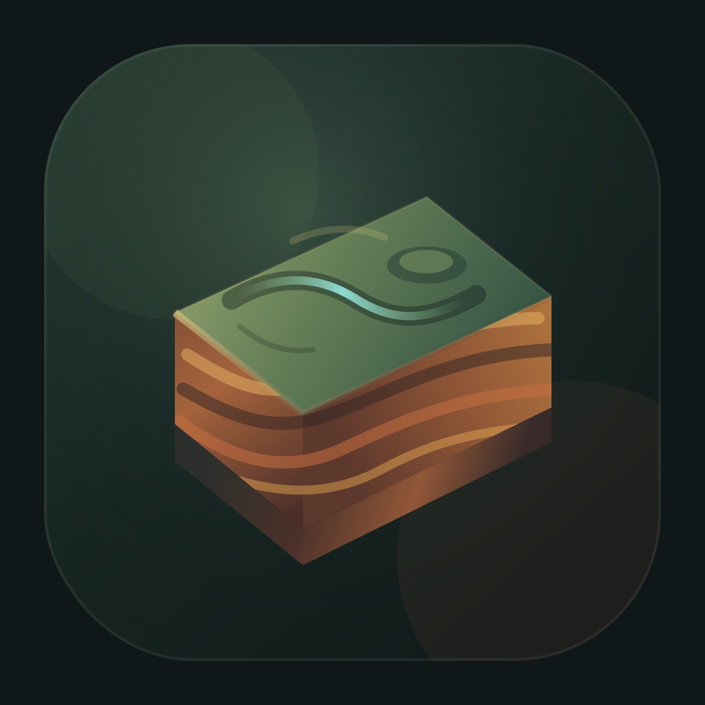

<p align="center">
  
</p>

<h1 align="center">Terrane</h1>

<p align="center">
  <strong>A local-first runtime for AI-generated, build-free webapps.</strong>
</p>

Terrane is a native WebView platform for apps generated as plain
`manifest.json`, `index.html`, `styles.css`, and `app.js` packages. The runtime
validates, signs, installs, runs, tests, repairs, snapshots, and rolls back those apps
without asking each generated app to become a native project or a bundled web app.

The short version: AI generates small webapps; Terrane supplies the trusted local
engine, bridge, storage, policy, tests, and native hosts.

## Use Terrane

Most people should not need to clone submodules, install native SDKs, or build
the platform before they can try Terrane.

### macOS App Download

The intended user path is a packaged macOS app from GitHub Releases:

1. Open the [latest Terrane release](https://github.com/sunrisecloudy/terrane/releases/latest).
2. Download the latest macOS disk image, for example `Terrane-macos-arm64.dmg`.
3. Open the disk image, then open or drag `terrane.app` to Applications.
4. Launch one of the bundled apps, such as **Notes Lite**.

The disk image contains a macOS app bundle with the runtime, bundled example
apps, SQLite migrations, and Zig core library. Users should not need
`git submodule`, Zig, Swift, Rust, or Node just to open the app.

Until the first GitHub Release is published, use the local preview below.

### Local Preview

The fastest way to understand Terrane is to run the reference host, open the
runtime, and launch a bundled generated app. The reference host is the local
contract implementation that lets you use the runtime without installing every
native platform toolchain first.

On Windows, keep the working checkout in the WSL/Linux filesystem instead of
`C:\` or `/mnt/c` for faster file watching, tests, native builds, and Unix-style
tooling. The recommended layout is:

```sh
mkdir -p ~/projects
cp -a /mnt/c/Users/veha/Project/terrane ~/projects/terrane
cd ~/projects/terrane
git submodule update --init --recursive
git status
```

Windows apps can still browse the Linux checkout through:

```text
\\wsl$\Ubuntu-24.04\home\<linux-username>\projects\terrane
```

Run build, test, and development commands from inside WSL at
`~/projects/terrane`; use the `\\wsl$` path mainly for Windows editors and file
browsing.

Start here:

```sh
git clone https://github.com/sunrisecloudy/terrane.git
cd terrane
node --no-warnings tools/reference-host/src/server.js --port 7878
```

Then open [http://127.0.0.1:7878](http://127.0.0.1:7878).

In that first preview session:

1. Choose **Notes Lite** from the app list.
2. Create, search, edit, and delete a note.
3. Watch the **Bridge Calls** panel update as the generated app asks Terrane for
   storage, notification, and log operations.
4. Try **Task Workbench** or **Core Replay Lab** when you want to see generated
   UI sending deterministic `core.step` events through the bridge.

If you want state to survive process restarts, run the host with a SQLite file:

```sh
node --no-warnings tools/reference-host/src/server.js --port 7878 --db-file terrane-dev.sqlite
```

The mental model for the running app is:

```text
Generated app package
  -> runtime-web sandbox
  -> reference-host bridge
  -> SQLite storage, policy checks, tests, and Zig core behavior
```

Terrane is still an active implementation/spec repository, not a stable public
SDK. Use the local preview above to explore the product shape; use
[IMPLEMENTATION_STATUS.md](IMPLEMENTATION_STATUS.md) to check what is complete,
partial, or spec-only before depending on a surface.

## Why Terrane Exists

AI is very good at producing focused app surfaces. It is much less pleasant to let
every generated app invent its own native permissions, storage model, dependency
tree, and deployment path.

Terrane keeps generated code small and constrained:

```text
AI output
  manifest.json
  index.html
  styles.css
  app.js
  smoke-tests.json
  migrations/*.json

Terrane owns
  validation
  policy audit
  canonicalization and signing
  sandboxed execution
  bridge permissions
  SQLite persistence
  snapshots and rollback
  smoke/micro tests
  native host parity
```

Generated apps use `AppRuntime.call(...)` for platform effects. They do not call
native APIs directly, do not use direct `fetch`, and do not own SQL.

## Product Shape

Terrane has two deliberate halves:

| Surface | Purpose |
|---|---|
| Open local runtime | Run generated apps locally, inspectably, and safely. |
| Private SaaS | Sync, backup, teams, marketplace publishing, enterprise governance, billing, and operations. |

The OSS server is the local Terrane engine, not the hosted SaaS backend. On
desktop it is intended to run inside the client over HTTP loopback. On mobile,
native hosts keep direct bridge dispatch because long-running embedded servers
are a poor platform fit.

See [docs/34_LOCAL_FIRST_OSS_SERVER_AND_SAAS_PRD.md](docs/34_LOCAL_FIRST_OSS_SERVER_AND_SAAS_PRD.md)
for the product boundary.

## Current Status

Terrane is an active implementation/spec repository. The system is not a stable
public SDK yet, but the major contract surfaces are already present:

- `runtime-web/` mounts generated apps in sandboxed frames and routes bridge calls.
- `tools/reference-host/` is the Node + SQLite reference contract implementation.
- `forge/` is the Rust v1 runtime workspace, including deterministic core logic, storage, sync/CRDT, FFI, CLI, and server crates.
- `forge/crates/server/` is the Rust HTTP local engine surface for core command and event-drain flows.
- `native/` contains iOS, macOS, Android, Windows, and Linux host targets.
- `webapps/examples/` contains five build-free example packages.
- `tests/` contains bridge, mutation, DB, micro, accessibility, security, server, CRDT, and performance fixtures.

The single source of truth for built vs planned work is
[IMPLEMENTATION_STATUS.md](IMPLEMENTATION_STATUS.md).

## Example Apps

Every example app is a build-free package with a manifest, HTML, CSS, JS, and
smoke tests:

| Example | What it exercises |
|---|---|
| `webapps/examples/notes-lite/` | Storage, search, toasts. |
| `webapps/examples/task-workbench/` | `core.step`, storage, stateful workflows. |
| `webapps/examples/file-transformer/` | File dialogs, core transform, save flow. |
| `webapps/examples/api-dashboard/` | Host-mediated network requests, tables, notifications. |
| `webapps/examples/core-replay-lab/` | Core replay, event log, export. |

Use these as references when creating generated apps. The package contract lives
in [docs/04_WEBAPP_PACKAGE_SPEC.md](docs/04_WEBAPP_PACKAGE_SPEC.md).

## Architecture

```text
Generated app package
  HTML/CSS/vanilla JS inside sandboxed iframe
        |
        v
runtime-web
  AppRuntime.call, mount channels, permissions, budgets
        |
        v
Host bridge
  native bridge or Zig local server
        |
        v
Platform services
  SQLite storage, dialogs, notifications, network policy, logs
        |
        v
Zig core
  deterministic event -> action state machines
```

The reference host is the oracle. Native hosts and the server are expected to
match its bridge responses for the same fixtures, after stripping fields that
are explicitly non-deterministic.

## Contributing

Contributor setup, generated-app rules, repository map, key docs, and release
packaging notes live in [CONTRIBUTION.md](CONTRIBUTION.md).

## License

MIT. See [LICENSE](LICENSE).
