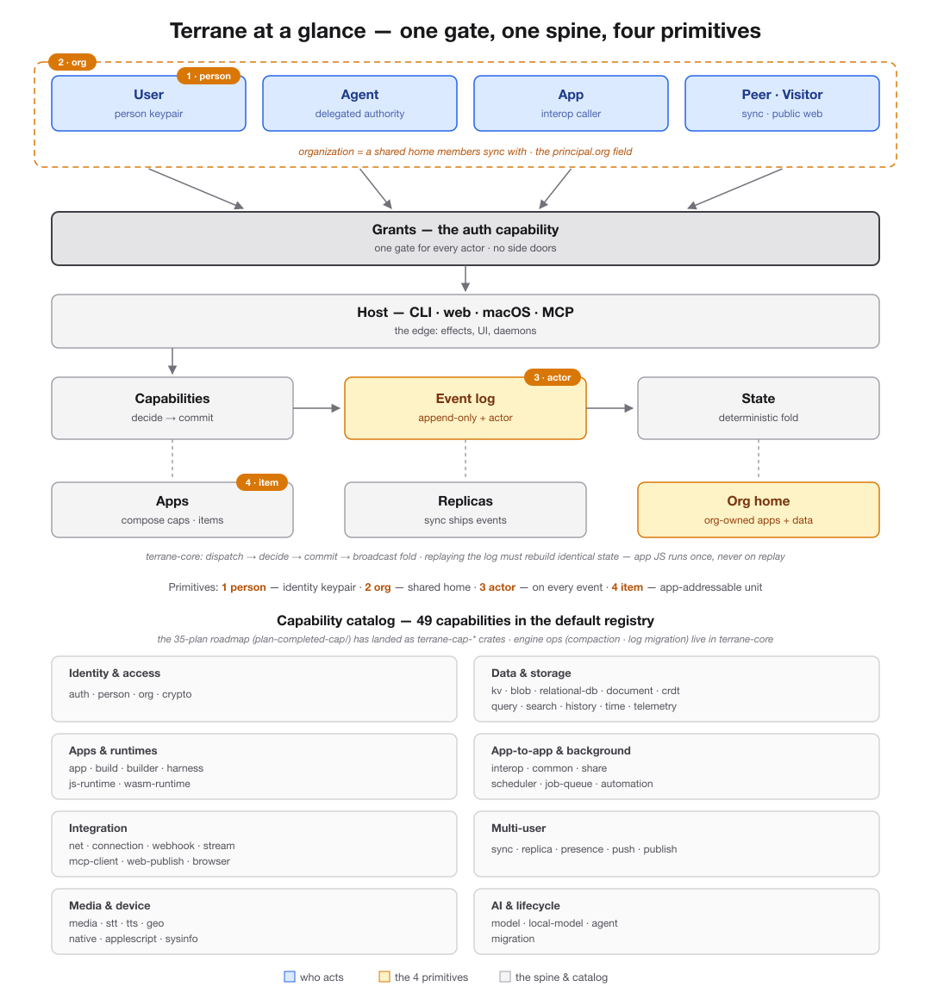

# Terrane at a glance — one gate, one spine, four primitives



Files: [architecture-diagram.png](architecture-diagram.png) ·
[architecture-diagram@2x.png](architecture-diagram@2x.png) (retina) ·
[architecture-diagram.svg](architecture-diagram.svg) (editable source)

## How to read it

Top to bottom is the request path. Every principal — the local user, a
delegated agent, a calling app, a syncing peer or public-web visitor — enters
through the same grant gate (the `auth` capability). The host layer (CLI, web,
macOS, MCP under `host/`) is the edge: effects, UI, and daemons. Below it sits
the deterministic spine in `terrane-core`: capabilities decide and commit,
events land in the append-only log, and state is a deterministic fold —
replaying the log must rebuild identical state, and app JS runs once, never on
replay (Option A).

The four primitives (amber, numbered):

1. **person** — durable identity as a local ed25519 keypair (`terrane-cap-person`), badged on the User box.
2. **org** — a shared home members sync with; the `org` field on `ExecutionPrincipal` (`rust/crates/terrane-cap-interface/src/abi.rs`), drawn as the dashed boundary around the principals.
3. **actor** — recorded on every event; the log carries a `record.actor` and the engine ships a one-time pre-actor log migration (`rust/crates/terrane-core/src/lib.rs`), badged on the Event log box.
4. **item** — the app-addressable unit `terrane://app/<id>/item/*`, registered per app (`rust/crates/terrane-cap-app/src/lib.rs`), badged on the Apps box.

Below the spine, the compositions: **Apps** compose capabilities and expose
items, **Replicas** sync by shipping events, and an **Org home** is
org-owned apps plus data.

## Capability catalog — 49 capabilities in the default registry

The original prompt described this band as a "Capability roadmap — 35 plans by
theme." That is now stale: the 35 capability plans (plus the 4 primitive plans)
in `plan-completed-cap/` have landed as `terrane-cap-*` crates, and
`default_registry()` in `rust/crates/terrane-core/src/lib.rs` registers **49
capabilities**. The band therefore shows the shipped catalog, grouped by the
same themes:

| Theme | Capabilities |
| --- | --- |
| Identity & access | auth · person · org · crypto |
| Data & storage | kv · blob · relational-db · document · crdt · query · search · history · time · telemetry |
| Apps & runtimes | app · build · builder · harness · js-runtime · wasm-runtime |
| App-to-app & background | interop · common · share · scheduler · job-queue · automation |
| Integration | net · connection · webhook · stream · mcp-client · web-publish · browser |
| Multi-user | sync · replica · presence · push · publish |
| Media & device | media · stt · tts · geo · native · applescript · sysinfo |
| AI & lifecycle | model · local-model · agent · migration |

Engine ops from the roadmap (compaction, log migration/backup-export) live
inside `terrane-core` itself, not as capability crates — as planned.

## What was updated from the prompt (verified against the codebase, 2026-07-06)

- **Roadmap band → shipped catalog.** "35 plans by theme" became "49
  capabilities in the default registry": every roadmap theme now exists as
  registered crates, so the band lists real crate names (e.g. the prompt's
  `net v2` is `terrane-cap-net`, `sync v2` is `terrane-cap-sync`,
  `connection` covers oauth-connections, `geo` covers geolocation).
  Capabilities the prompt's roadmap didn't list but that exist today were
  added: crypto, relational-db, search, build, builder, harness, js-runtime,
  wasm-runtime, replica, stt, sysinfo, agent, local-model, kv, crdt, app, auth.
  `capture` and `deep-links` shipped inside `native` and `app` respectively
  rather than as separate crates.
- **Hosts confirmed as-is.** `host/` contains exactly `cli`, `web`, `macos`,
  `mcp` — matching the prompt's "CLI · web · macOS · MCP".
- **All four primitives confirmed implemented**, not just planned: person and
  org are registered capabilities, actor is on every event record (with the
  pre-actor migration in the engine), and `terrane://app/<id>/item/*` link
  registration is live in the app capability.
- **Spine caption added** from the one rule in `README.md`/`CLAUDE.md`:
  dispatch → decide → commit → broadcast fold, replay-identical state, app JS
  never re-run on replay.

## Style

Flat, no gradients or shadows. Two color ramps only: **blue = who acts**,
**amber = the 4 primitives**; everything else neutral gray (the spine and the
catalog). Regenerate the PNGs from the SVG with:

```sh
rsvg-convert -o architecture-diagram.png architecture-diagram.svg
rsvg-convert --zoom 2 -o architecture-diagram@2x.png architecture-diagram.svg
```
